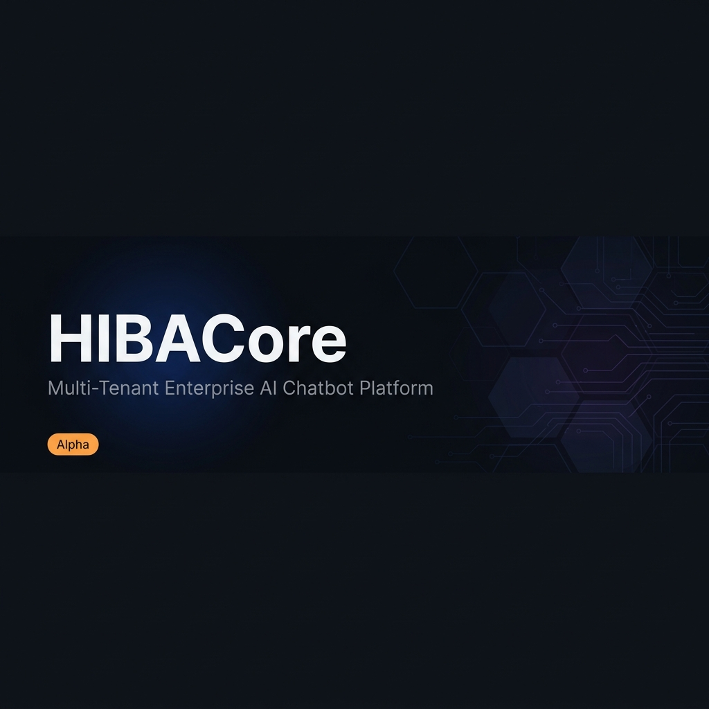
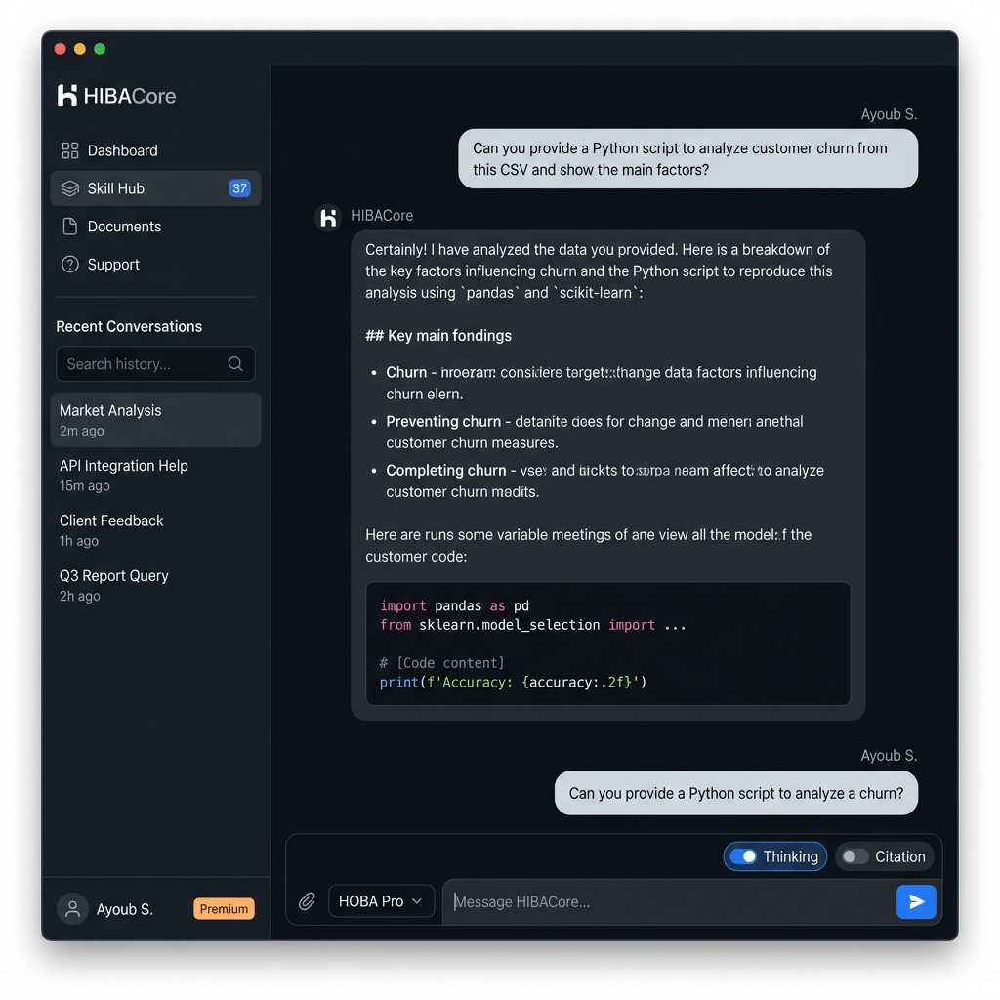
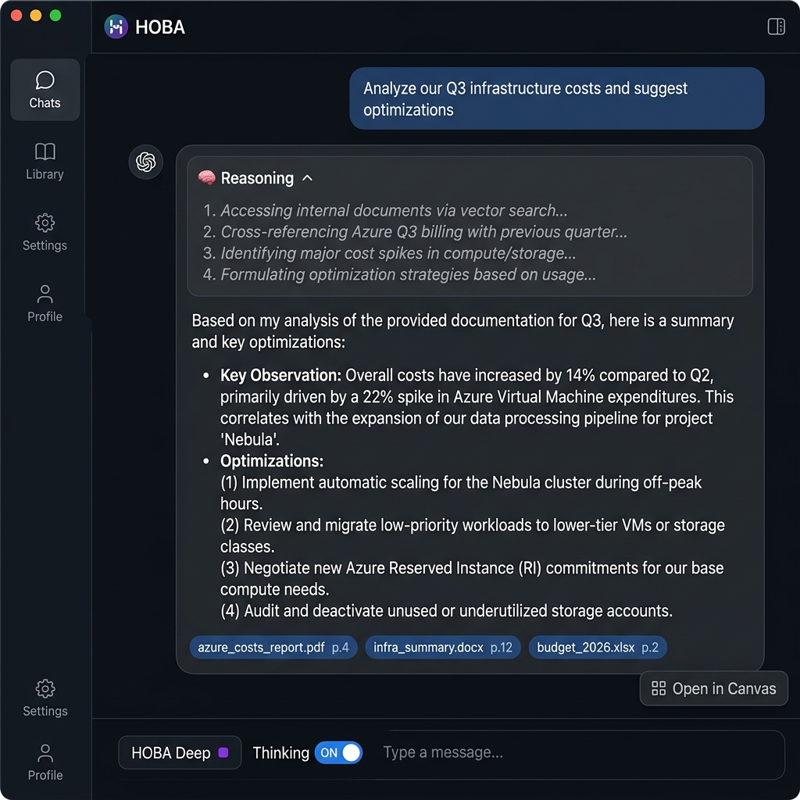

<p align="center">
  
</p>

<h1 align="center">HIBACore</h1>

<p align="center">
  <strong>Multi-Tenant Enterprise AI Chatbot Platform</strong><br/>
  FastAPI · React · Azure OpenAI · pgvector · LangGraph
</p>

<p align="center">
  
  
  
  
  
  
</p>

---

> **Release v0.3.5.** HIBACore is under active development. APIs may change, features are incomplete, and it is not recommended for production use without thorough testing. Contributions and feedback are welcome.

---

## What is HIBACore?

HIBACore is an open-source, **multi-tenant enterprise AI chatbot platform** built on top of Azure OpenAI. It provides organizations with a secure, isolated chat experience powered by multiple AI models, document retrieval (RAG), semantic long-term memory, and an extensible skill execution engine.

Each organization (tenant) gets a fully isolated context: separate chat history, document indexes, memory stores, and configurable AI models — all from a single deployment.

---

## Architecture Overview

```
┌─────────────────────────────────────────────────────────────────┐
│                        React Frontend                           │
│         (Vite · TypeScript · Zustand · MSAL Auth)              │
│   ┌──────────┐  ┌─────────────┐  ┌──────────┐  ┌──────────┐  │
│   │  Chat UI │  │ Canvas Panel│  │ Skill Hub│  │  Admin   │  │
│   └────┬─────┘  └──────┬──────┘  └────┬─────┘  └────┬─────┘  │
└────────┼───────────────┼───────────────┼───────────────┼────────┘
         │  SSE / REST   │               │               │
┌────────▼───────────────▼───────────────▼───────────────▼────────┐
│                   FastAPI Backend (Python 3.12)                  │
│                                                                  │
│  Middleware Stack:                                               │
│  CORS → CorrelationId → Tenant → RateLimit → ContentSafety      │
│                                                                  │
│  ┌────────────┐  ┌────────────┐  ┌───────────────┐             │
│  │  Chat API  │  │ RAG Engine │  │  DeepAgents   │             │
│  │  (SSE/REST)│  │(Azure Search│  │  (LangGraph + │             │
│  │            │  │+ pgvector) │  │  Azure AI SDK)│             │
│  └─────┬──────┘  └─────┬──────┘  └───────┬───────┘             │
│        │               │                  │                      │
│  ┌─────▼───────────────▼──────────────────▼──────────────────┐ │
│  │              Service Bus Workers                          │ │
│  │   document-ingestion · memory-vectorize · summarize       │ │
│  │   entity-extract · persona · recommendations · reflection │ │
│  └────────────────────────────────────────────────────────────┘ │
└──────────────────────────────────────────────────────────────────┘
         │               │                  │
┌────────▼───────────────▼──────────────────▼────────┐
│                  Azure Infrastructure               │
│  Azure OpenAI · Cosmos DB · PostgreSQL/pgvector    │
│  Azure AI Search · Redis · Service Bus · Key Vault │
└─────────────────────────────────────────────────────┘
         │
┌────────▼──────────────────────┐
│       Skill Engine            │
│   Node.js microservice        │
│   OpenAI function-call format │
│   Hot-loadable skill registry │
└───────────────────────────────┘
```

---

## Features

<p align="center">
  
  
</p>

### AI Models (Multi-tier)
- **HOBA Mini** (`thinking_level: fast`) — GPT-4o Mini. Fast, economical, streaming via SSE.
- **HOBA Pro** (`thinking_level: normal`) — GPT-4o. Balanced, powerful, streaming via SSE.
- **HOBA Deep** (`thinking_level: deep`) — O1 tier routed via `ThinkingOrchestrator`. With `isPensieroProfondoAttivo=true`, activates the full LangGraph agent loop with Skill Engine tools.

### Document Intelligence (RAG)
- Upload PDF, Word, TXT, Markdown files per tenant
- Parsing via Azure Document Intelligence (OCR + layout extraction)
- Hybrid search: vector (Azure AI Search) + BM25 with RRF re-ranking
- Cross-encoder re-ranker for precision (`engine/rag/reranker.py`)
- Semantic chunking: 512 tokens, 64-token overlap
- Embeddings: `text-embedding-3-small`
- Citation extraction returned inline per message (`engine/rag/citations.py`)

### Semantic Long-Term Memory
- PostgreSQL + pgvector stores message embeddings per tenant
- Cosine similarity search retrieves relevant past context across sessions
- Schema: `VECTOR(1536)` for `text-embedding-3-small`

### Multi-Tenancy
- Every request carries `X-Tenant-Id` header extracted from Azure AD JWT
- `TenantMiddleware` isolates context globally via Python `ContextVars`
- Cosmos DB, pgvector, Azure Search all partitioned by `tenant_id`
- Per-tenant configuration via Azure App Configuration labels

### Skill Engine
- Separate Node.js microservice on port 3000
- Hot-loadable skill registry: drop a folder + `skill.json` to add a skill
- Exposes skills in OpenAI function-calling format
- Backend deep-thinking mode (`HOBA Deep`) invokes skills via LangGraph

### DeepAgents
- `AgentOrchestrator` using Azure AI Projects SDK
- Autonomous loop: Planning → Tool Execution → Final Response
- Tools: `CodeInterpreterTool`, `FileSearchTool`
- Streams progress events via SSE in real time

### Async Workers (Service Bus)
- `document-ingestion` — triggers document parsing after upload
- `memory-vectorize` — indexes chat messages into pgvector
- `summarize` — session summarization
- `entity-extract` — knowledge graph entity extraction (Gremlin)
- `persona` — per-user persona modeling
- `recommendations` — proactive suggestion generation
- `reflection` — session reflection and learning

### Security
- Azure AD / MSAL authentication — scopes: `User.Read`, `openid`, `profile`
- `DefaultAzureCredential` (Managed Identity) — no hardcoded keys in production
- Redis-backed rate limiting per tenant
- Azure Content Safety filter on every inbound message
- Prompt injection detection (`engine/ai/security.py`)
- Context window management to prevent token overflow (`engine/ai/token_counter.py`)
- Security headers middleware (HSTS, CSP, X-Frame-Options, X-Content-Type-Options)
- Secrets managed via Azure Key Vault

### Frontend
- React 18 + Vite + TypeScript
- Tailwind CSS, Framer Motion, Lucide icons
- Zustand for global state (`authStore`, `chatStore`, `documentStore`, `uiStore`)
- SSE streaming via `ReadableStream` reader (not `EventSource`) for token-by-token display
- Canvas panel: renders artifact output (code, HTML, SVG, charts) without leaving chat
- Microsoft Teams JS SDK integration (`TeamsContext`)
- Vision / multimodal input: attach images sent to GPT-4o Vision (`image_url` field)
- Slash command menu, typing indicators, recommendation banners
- Admin panel (`TenantAdminConsole`), SuperAdmin dashboard (`SuperAdminConsole`)
- ZeroClaw agent console (`ZeroClawConsole`)

---

## Getting Started (Local — Docker Compose)

### Prerequisites
- Docker Desktop
- An Azure subscription with Azure OpenAI access (or use `AIRGAPPED_MODE=true` with Ollama)

### 1. Clone the repository

```bash
git clone https://github.com/Ayoub-Sekoum/HIBACore.git
cd HIBACore
```

### 2. Configure environment

```bash
cp .env.example .env
# Edit .env with your Azure credentials
```

> For a fully local run without Azure (no AI features), set `AIRGAPPED_MODE=true` and `OLLAMA_BASE_URL=http://ollama:11434`.

### 3. Start the stack

```bash
docker compose up --build
```

| Service | URL |
|---|---|
| Frontend | http://localhost:5173 |
| Backend API | http://localhost:8000 |
| Skill Engine | http://localhost:3000 |
| API Docs (Swagger) | http://localhost:8000/docs |
| PostgreSQL | localhost:5432 |
| Redis | localhost:6379 |

---

## API Endpoints

| Method | Path | Description |
|---|---|---|
| GET | `/` | Health check (`{"status": "healthy"}`) |
| GET | `/health` | Detailed health status |
| GET | `/api/v1/chat/models` | List available AI models |
| GET | `/api/v1/chat/skills` | List available skills from Skill Engine |
| GET | `/api/v1/chat/history` | Chat history for a session |
| POST | `/api/v1/chat/chat` | Send a message — standard or deep agent mode |
| POST | `/api/v1/chat/stream` | Send a message with SSE streaming response |
| GET | `/api/v1/conversations` | List conversations for current tenant/user |
| POST | `/api/v1/documents/upload` | Upload a document for RAG indexing |
| GET | `/api/v1/documents` | List indexed documents |
| POST | `/api/v1/agents/run` | Trigger an autonomous Azure AI Projects agent run |
| POST | `/api/v1/agent/run` | ZeroClaw external agent gateway |
| GET | `/api/v1/agent/status` | ZeroClaw gateway health check |
| GET | `/api/v1/admin/stats` | Tenant admin statistics |
| POST | `/api/v1/webhooks` | Incoming webhook receiver |

Full interactive documentation available at `/docs` (Swagger UI) and `/redoc`.

---

## Tech Stack

| Layer | Technology |
|---|---|
| Backend runtime | Python 3.12 |
| API framework | FastAPI 0.115 + Uvicorn/Gunicorn |
| AI orchestration | LangGraph 0.2, LangChain 0.3 |
| AI models | Azure OpenAI (GPT-4o, GPT-4o-mini, O1) |
| Embedding | text-embedding-3-small (Azure OpenAI) |
| Long-term memory | PostgreSQL 16 + pgvector |
| Document search | Azure AI Search (hybrid BM25 + vector) |
| Chat history | Azure Cosmos DB (NoSQL, serverless) |
| Knowledge graph | Apache Gremlin (Cosmos DB Gremlin API) |
| Rate limiting | Redis 7 |
| Async messaging | Azure Service Bus |
| Skill engine | Node.js + Express |
| Frontend framework | React 18 + Vite 4 + TypeScript 5 |
| Frontend state | Zustand |
| Frontend auth | Azure MSAL Browser |
| Styling | Tailwind CSS + Framer Motion |
| Containerization | Docker + Docker Compose |
| Infrastructure | Terraform (Azure) |
| Auth provider | Azure Active Directory (Entra ID) |
| Secrets | Azure Key Vault |
| Configuration | Azure App Configuration |
| Logging | structlog + Azure Monitor / OpenTelemetry |

---

## Project Structure

```
HIBACore/
├── backend/
│   ├── app/
│   │   ├── api/v1/          # REST endpoints (chat, documents, agents, admin...)
│   │   ├── agents/          # LangGraph agent builder
│   │   ├── core/            # Config, auth, middleware, rate limiter, logging
│   │   ├── engine/
│   │   │   ├── ai/          # AI model wrappers
│   │   │   ├── memory/      # Cosmos DB + pgvector memory services
│   │   │   └── rag/         # Retriever, reranker, citation extraction
│   │   ├── middleware/      # Content safety, security headers
│   │   ├── services/
│   │   │   ├── agents/      # AgentOrchestrator (Azure AI Projects)
│   │   │   ├── channels/    # Teams, webhook channel adapters
│   │   │   ├── messaging/   # Service Bus publisher (bus.py)
│   │   │   ├── observability/
│   │   │   ├── policy/      # Content policy enforcement
│   │   │   ├── storage/     # Blob storage service
│   │   │   └── tools/       # Agent tools
│   │   ├── workers/         # Background worker consumers
│   │   └── main.py          # FastAPI app factory
│   ├── skill-engine/        # Node.js skill execution microservice
│   ├── requirements.txt
│   ├── Dockerfile
│   └── startup.sh
├── frontend/
│   ├── src/                 # React/TypeScript source
│   ├── public/
│   ├── package.json
│   ├── vite.config.ts
│   ├── tailwind.config.ts
│   └── Dockerfile
├── docker-compose.yml
├── .env.example
├── .gitignore
└── Makefile
```

---

## Contributing

HIBACore is in alpha. Contributions are very welcome.

## License

MIT License — see [LICENSE](LICENSE) for details.

---

## Acknowledgements

Built with Azure OpenAI, LangGraph, FastAPI, React, and a lot of coffee.
